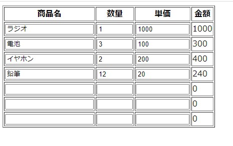

# Vue.jsのレッスンを始めます。

と、その前に。マークダウン記法によるドキュメント作成にはAtomエディタを使ってます。ありがとうAtom。

### 第一章　Vue.jsってなに？
まあ、とっても便利なHTML―Javascriptインターフェースツールといったらいいのかな。とりあえず知らない人はググってください。

### 早速
まずはVueを使わずに、一番簡単なサンプルプログラムを書いてみましょう。
```
(lsn01_01.html)

<html>

<p><input type="text" id="name" size="10" onkeyup="dspEcho()"></P>

<p id= "echo"></p>

<script>
function dspEcho(){
  document.getElementById('echo').innerText
  =document.getElementById('name').value
}
</script>

</html>
```
このコードは入力した値をエコーするためのものです。
DOMを使って値を参照し、別のDOMに値を書き込んでいますね。

どのキーイベントでどのファンクションが動くかをプログラマーは意識して書く必要がありますね。

では、Vueではどのような書き方になるでしょうか

```
(lsn01_02.html)

<html>
<script src="https://cdn.jsdelivr.net/npm/vue"></script>

<div id="app">

<p><input type="text" v-model="name" size="10" ></P>

<p>{{name}}</p>

</div>

<script>
var app=new Vue({
  el: '#app',
  data:{
    name: '',
  }
})
</script>

</html>
```
どうでしょうか？
DOMの存在が消えてます。イベントを気にしなくてもいいのです。functionすらいりません。
面倒なことはすべてVueが裏側でやってくれるわけです。
やることは、最初にVueを引っ張ってくるだけです。

こんなに簡単にできてしまうわけですが、項目どうしで値が変化するものにも対処できるのかと疑問が湧きます。たとえば数量と単価を入力したらその合計を自動で計算する、とかいったものです。次の例に答えがあります。

```
(lsn01_03.html)

<html>
<script src="https://cdn.jsdelivr.net/npm/vue"></script>

<div id="app">

<p>数量:<input type="text" v-model="suryo" size="10" ></P>
<p>単価:<input type="text" v-model="tanka" size="10" ></P>

<p>金額:{{kingaku}}</p>

</div>

<script>
var app=new Vue({
  el: '#app',
  data:{
    suryo: 0,
    tanka: 0,
  },
  computed: {
    kingaku: function(){
      return( this.suryo * this.tanka )
    }
  }
})
</script>

</html>

```
逐次計算させて表示するというだけなら実はもっと簡単な方法があります。{{}}の中で変数どうしを計算させてしまうのです。

```
(lsn01_04.html)

<html>
<script src="https://cdn.jsdelivr.net/npm/vue"></script>

<div id="app">

<p>数量:<input type="text" v-model="suryo" size="10" ></P>
<p>単価:<input type="text" v-model="tanka" size="10" ></P>

<p>金額:{{suryo*tanka}}</p>

</div>

<script>
var app=new Vue({
  el: '#app',
  data:{
    suryo: 0,
    tanka: 0,
  },
})
</script>

</html>
```

### 配列とv-forについて話をしよう

サンプルで見たように数量とか単価を単一で扱うことは簡単でしたが、複数行で扱いたいという場合どうしたらよいでしょう。
その場合、複数のデータが集合した配列で管理がしたいですね。

数量と金額のデータが複数ある場合でそれを表示したい場合などはv-forを使います。

```
(lsn01_05.html)

<html>
<script src="https://cdn.jsdelivr.net/npm/vue"></script>

<div id="app">

<li v-for="item in items" >
  {{item.hinmei}} {{item.suryo}} {{item.tanka}} {{item.suryo*item.tanka}}
</li>

</div>

<script>
var app=new Vue({
  el: '#app',
  data:{
    items:[
      {hinmei:'ラジオ',suryo:1, tanka:1000},
      {hinmei:'電池',suryo:3, tanka:100},
      {hinmei:'イヤホン',suryo:1, tanka:200},
    ]
  }
})
</script>

</html>
```
テーブルを使ってちょっとだけ見やすくしてみましょう。
```
(lsn01_06.html)

<html>
<script src="https://cdn.jsdelivr.net/npm/vue"></script>

<div id="app">

<table border="1">
<tr><th>商品名</th><th>数量</th><th>単価</th><th>金額</th></tr>
<template v-for="item in items" >
  <tr>
    <td>{{item.hinmei}}</td>
    <td>{{item.suryo}}</td>
    <td>{{item.tanka}}</td>
    <td>{{item.suryo*item.tanka}}</td>
  </tr>
</template>
</table>

</div>

<script>
var app=new Vue({
  el: '#app',
  data:{
    items:[
      {hinmei:'ラジオ',suryo:1, tanka:1000},
      {hinmei:'電池',suryo:3, tanka:100},
      {hinmei:'イヤホン',suryo:2, tanka:200},
      {hinmei:'鉛筆',suryo:12, tanka:20},
    ]
  }
})
</script>

</html>
```
さて、ここまでできれば、あとはデータの入力をどうするかです。表示だけでなく入力ができれば、表の中のデータを変更して表計算のような形でデータの入力が可能になります。Vueを使えば比較的簡単に実現できます。答えは次のコード。
```
(lsn01_07.html)

<html>
<script src="https://cdn.jsdelivr.net/npm/vue"></script>

<div id="app">

<table border="1">
<tr><th>商品名</th><th>数量</th><th>単価</th><th>金額</th></tr>
<template v-for="item in items" >
  <tr>
    <td><input type="text" v-model="item.hinmei" size="20" ></td>
    <td><input type="text" v-model="item.suryo" size="5" ></td>
    <td><input type="text" v-model="item.tanka" size="10" ></td>
    <td width="200px">{{item.suryo*item.tanka}}</td>
  </tr>
</template>
</table>

</div>

<script>
var app=new Vue({
  el: '#app',
  data:{
    items:[
      {hinmei:'ラジオ',suryo:1, tanka:1000},
      {hinmei:'電池',suryo:3, tanka:100},
      {hinmei:'イヤホン',suryo:2, tanka:200},
      {hinmei:'鉛筆',suryo:12, tanka:20},
      {hinmei:'',suryo:null, tanka:null},
      {hinmei:'',suryo:null, tanka:null},
      {hinmei:'',suryo:null, tanka:null},
    ]
  }
})
</script>

</html>
```
表示例　
各項目に入力可能です。自動的に金額が計算されます。


